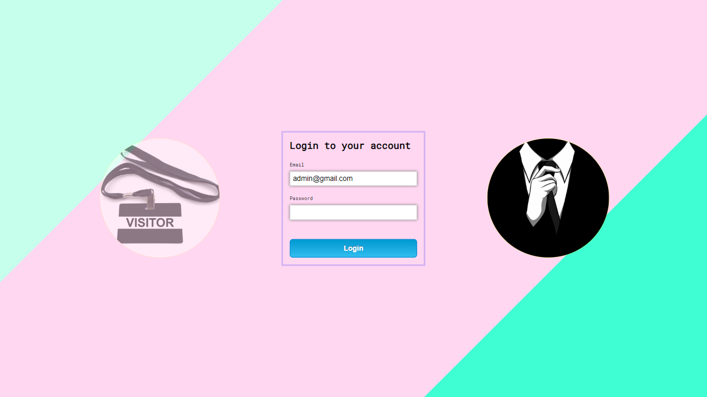
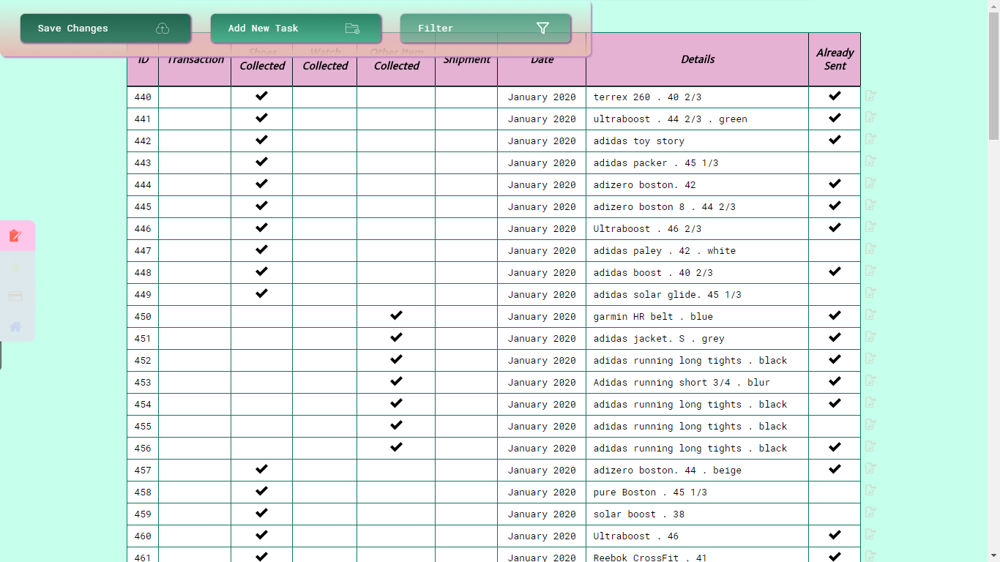
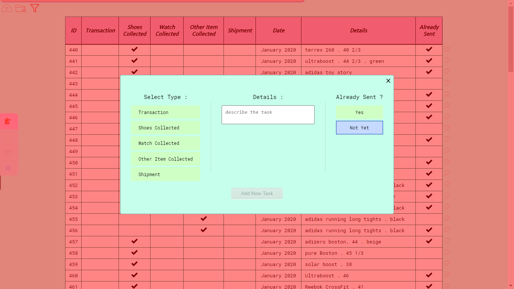
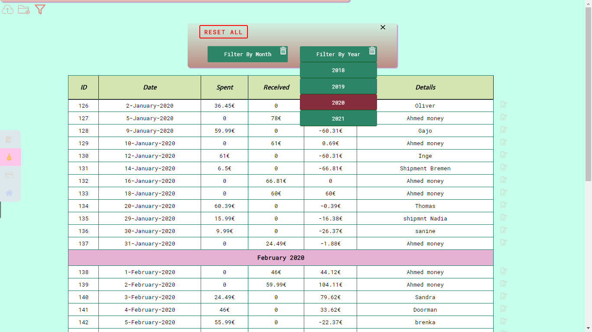

# FrippaShop

is a WebApp built with Angular 9.
It serves as data management system for a small-time retail company.

### Implemented Features & Techniques :

* Data fetched and stored from Firebase Realtime Database.
* CRUD operations, to modify, delete and update data.
* Angular Animation is used for smoother transition between different routes.
* Styling templates made-easy via Sass and heavy use of Flexbox.
* Routes are protected via Route Guards. Hence, user authentication is required.
* Custom Directives are implemented to access and manipulate the DOM (for UI purposes)
* Custom Pipes are created for filtering and properly formatting the data.
* Multiple Services are used for proper state management. 
* Pre-loading feature modules is implemented for faster UI rendering.
* App is fully responsive and ideal for use on mobile devices.

__________________________________________________________________

__________________________________________________________________

__________________________________________________________________

__________________________________________________________________

